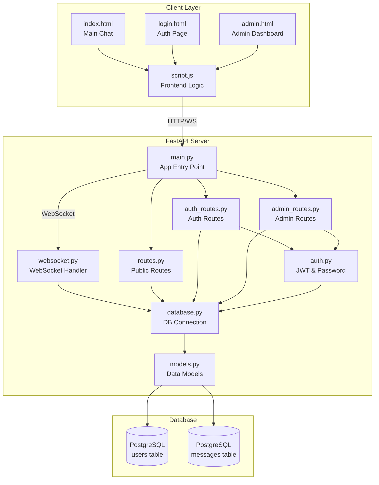
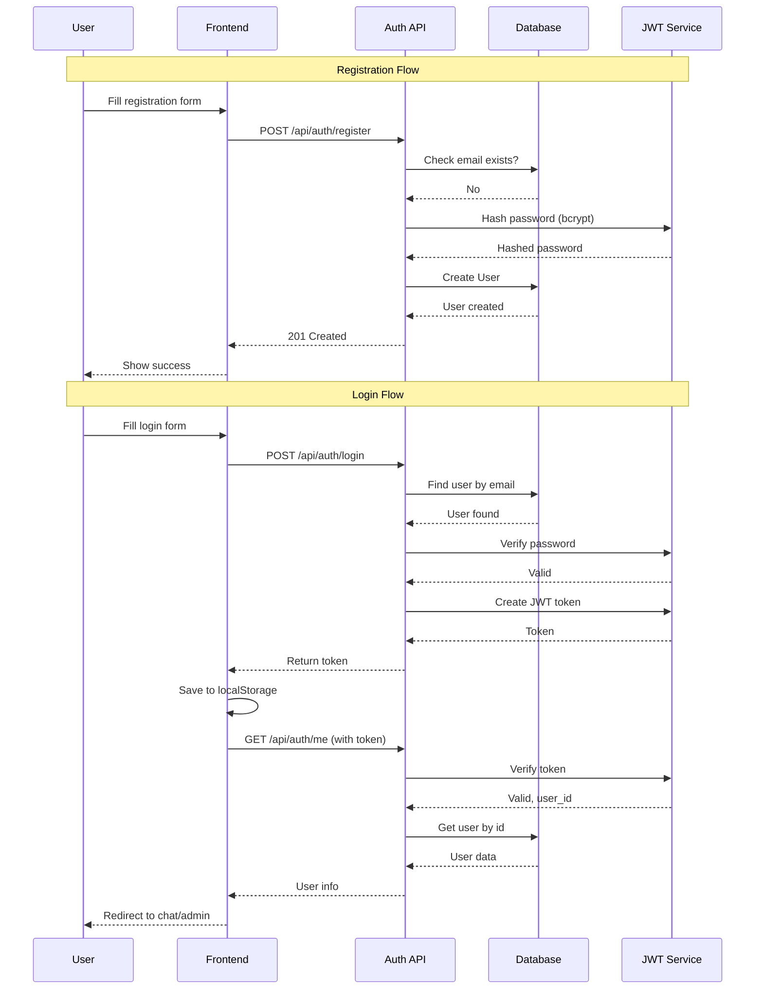
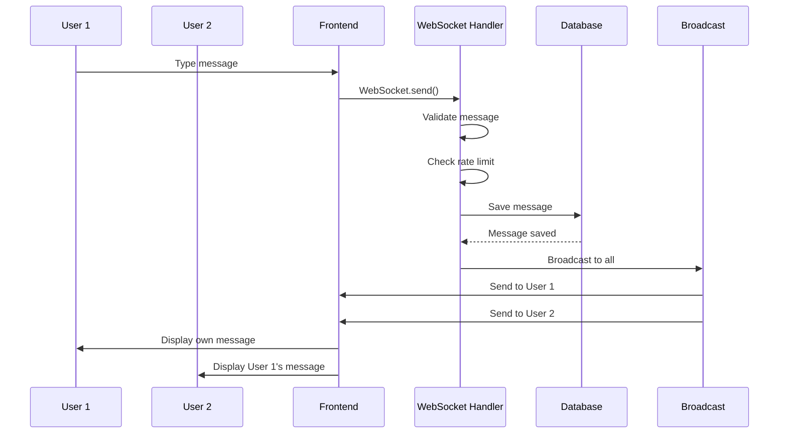
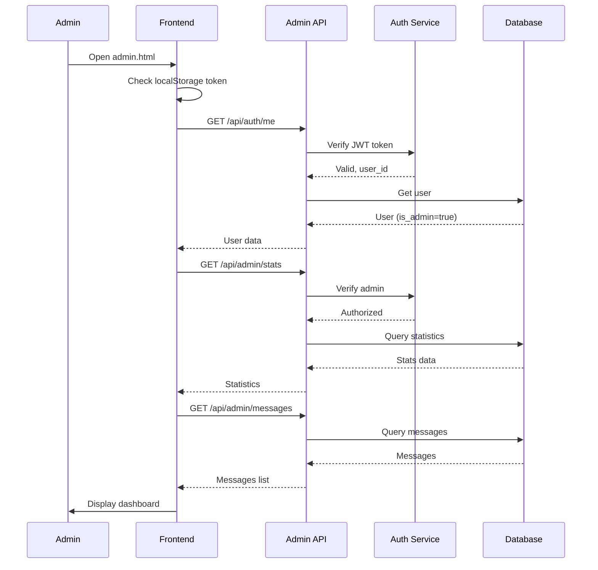
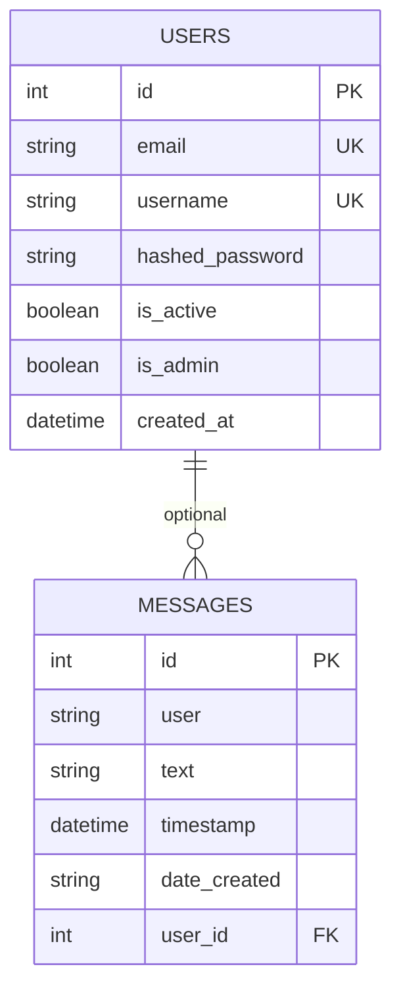
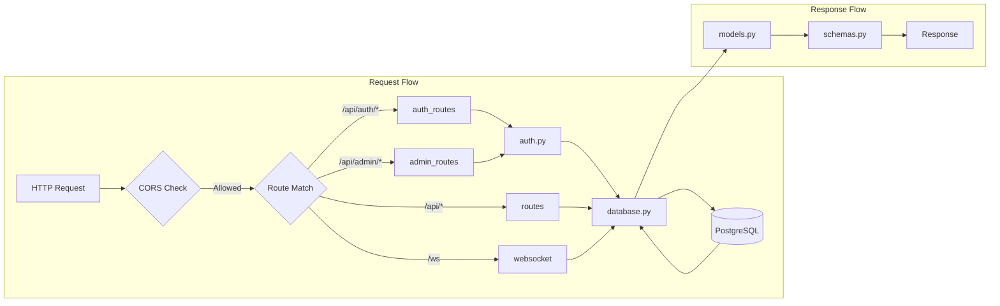
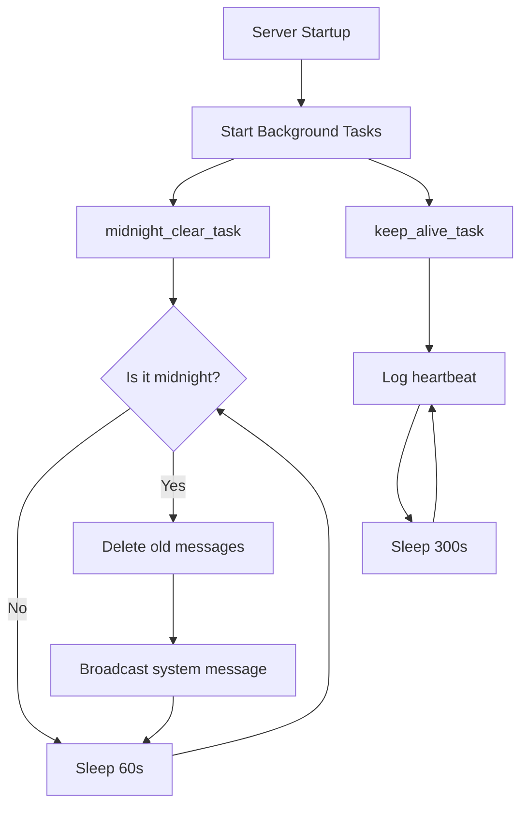
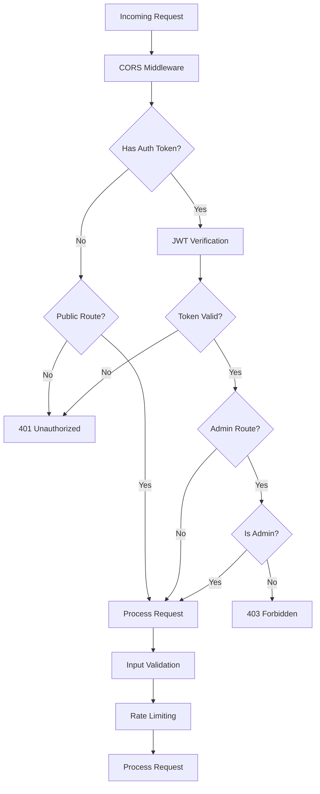
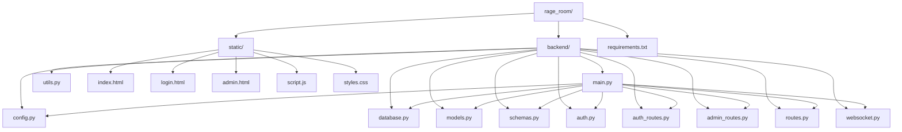

# 🎨 Rage Room - Visual Architecture Diagrams

## System Overview

## Authentication Flow

## Chat Message Flow (WebSocket)

## Admin Dashboard Flow

## Database Schema

## Component Interaction

## Background Tasks

## Security Layers

## File Structure

---

